# HKEX Agent 架构图

```mermaid
graph TB
    %% 用户接口层
    subgraph "用户接口层"
        CLI["CLI (hkex)<br/>命令行入口 + 快捷键<br/>--show-thinking / Ctrl+O / Ctrl+T"]
        ContextUI["Context Monitor<br/>Token占用 + 颜色预警"]
        ProjectUtils["Project Utils<br/>项目检测 (.hkex-agent)<br/>agent_dir 解析"]
        API["API Client<br/>Python SDK"]
    end

    %% 代理层
    subgraph "代理层"
        MainAgent["Main Agent<br/>DeepAgents主代理"]
        subgraph "子代理 (Subagents)"
            PDFAnalyzer["PDF Analyzer<br/>PDF内容分析"]
            ReportGen["Report Generator<br/>结构化报告生成"]
        end
    end

    %% 中间件层
    subgraph "中间件层 (Middleware)"
        MemoryMW["AgentMemoryMiddleware<br/>双范围内存注入"]
        SkillsMW["SkillsMiddleware<br/>渐进式披露"]
        SubAgentMW["SubAgentMiddleware<br/>子代理编排"]
        SummarizationMW["SummarizationMiddleware<br/>自动摘要/上下文压缩"]
        ShellMW["ResumableShellToolMiddleware<br/>Shell命令恢复"]
    end

    %% 工具层
    subgraph "工具层 (Tools)"
        HKEXTools["HKEX Tools<br/>search/get_latest/get_stock_info/get_categories"]
        PDFTools["PDF Tools<br/>download/extract/analyze/get_cached_pdf_path"]
        SummaryTools["Summary Tools<br/>generate_summary_markdown"]
        MCPTools["MCP Tools<br/>外部MCP服务器集成"]
    end

    %% 服务层
    subgraph "服务层 (Services)"
        HKEXService["HKEX API Service<br/>get_stock_id/search/get_latest/get_categories"]
        PDFService["PDF Parser Service<br/>download/extract_text/extract_tables/analyze_structure"]
    end

    %% 提示词层
    subgraph "提示词层 (Prompts)"
        SystemPrompt["System Prompts<br/>main_system_prompt<br/>longterm_memory_prompt"]
        SubagentPrompts["Subagent Prompts<br/>pdf_analyzer_prompt<br/>report_generator_prompt"]
    end

    %% 存储层
    subgraph "存储层 (Backends)"
        CompositeBackend["Composite Backend<br/>路径路由管理"]
        PDFCache["PDF Cache Backend<br/>/pdf_cache/<br/>[Virtual Mode]"]
        Memories["Memories Backend<br/>用户级 + 项目级<br/>[Virtual Mode]"]
        SkillsBackend["Skills Backend<br/>YAML frontmatter 技能库"]
        MDBackend["MD Backend<br/>Markdown摘要缓存<br/>[Virtual Mode]"]
        DefaultFS["Default Filesystem<br/>沙箱化工作目录<br/>[Virtual Mode]"]
    end

    %% 外部服务
    subgraph "外部服务"
        HKEXAPI["HKEX API"]
        MCPServers["MCP Servers<br/>CCASS分析等扩展工具"]
        LLM["Language Models<br/>SiliconFlow / OpenAI / Anthropic"]
    end

    %% 连接关系
    CLI --> MainAgent
    CLI --> ContextUI
    CLI --> ProjectUtils
    API --> MainAgent

    ProjectUtils --> MemoryMW
    ProjectUtils --> SkillsMW

    MainAgent --> SubAgentMW
    SubAgentMW --> PDFAnalyzer
    SubAgentMW --> ReportGen

    MainAgent --> MemoryMW
    MainAgent --> SkillsMW
    MainAgent --> ShellMW
    MainAgent --> SummarizationMW
    MainAgent --> HKEXTools
    MainAgent --> PDFTools
    MainAgent --> SummaryTools
    MainAgent --> MCPTools
    MainAgent --> SystemPrompt
    MainAgent --> CompositeBackend
    MainAgent --> LLM

    SummarizationMW --> LLM

    PDFAnalyzer --> PDFTools
    PDFAnalyzer --> SubagentPrompts
    ReportGen --> HKEXTools
    ReportGen --> PDFTools
    ReportGen --> SubagentPrompts

    HKEXTools --> HKEXService
    PDFTools --> PDFService
    PDFTools --> HKEXService
    MCPTools --> MCPServers

    HKEXService --> HKEXAPI
    PDFService --> HKEXAPI
    PDFService --> PDFCache

    MemoryMW --> Memories
    SkillsMW --> SkillsBackend
    SummaryTools --> MDBackend

    CompositeBackend --> PDFCache
    CompositeBackend --> Memories
    CompositeBackend --> SkillsBackend
    CompositeBackend --> MDBackend
    CompositeBackend --> DefaultFS

    %% 样式
    classDef userInterface fill:#e1f5ff,stroke:#01579b,stroke-width:2px
    classDef agent fill:#f3e5f5,stroke:#4a148c,stroke-width:2px
    classDef tool fill:#e8f5e9,stroke:#1b5e20,stroke-width:2px
    classDef service fill:#fff3e0,stroke:#e65100,stroke-width:2px
    classDef storage fill:#fce4ec,stroke:#880e4f,stroke-width:2px
    classDef middleware fill:#e0f2f1,stroke:#004d40,stroke-width:2px
    classDef external fill:#ffebee,stroke:#b71c1c,stroke-width:2px
    classDef prompt fill:#f1f8e9,stroke:#33691e,stroke-width:2px

    class CLI,ContextUI,ProjectUtils,API userInterface
    class MainAgent,PDFAnalyzer,ReportGen agent
    class HKEXTools,PDFTools,SummaryTools,MCPTools tool
    class HKEXService,PDFService service
    class CompositeBackend,PDFCache,Memories,SkillsBackend,MDBackend,DefaultFS storage
    class MemoryMW,SkillsMW,ShellMW,SubAgentMW,SummarizationMW middleware
    class HKEXAPI,LLM,MCPServers external
    class SystemPrompt,SubagentPrompts prompt
```

## 架构说明

### 1. 用户接口层
- **CLI**: 命令行接口，提供交互式终端界面
  - **上下文监控**: 实时显示 Token 使用情况，支持 20+ 模型
  - **智能颜色预警**: 绿色 (< 50%)、橙色 (50-80%)、红色 (> 80%)
  - **底部工具栏**: 显示 `Context: 12,345 / 170,000 (7.3%)`
  - **Show Thinking** (NEW): `--show-thinking` 标志显示 Agent 推理过程
  - **Tool Outputs Toggle** (NEW): `Ctrl+O` 切换工具输出显示/隐藏
  - **Auto-Approve Toggle**: `Ctrl+T` 切换自动批准模式
- **Context Monitor**: 独立展示当前上下文占用与颜色预警
- **Project Utils** (NEW): 自动检测项目根目录 (.hkex-agent 或 .git) 并解析 `agent_dir`
- **API Client**: Python API客户端，支持程序化调用

### 2. 代理层
- **Main Agent**: 主代理，基于 DeepAgents 框架构建
- **PDF Analyzer**: 专门用于PDF内容分析的子代理
- **Report Generator**: 专门用于生成结构化报告的子代理

### 3. 工具层
- **HKEX Tools**: 港交所公告搜索和信息获取工具
- **PDF Tools**: PDF下载、提取和分析工具
  - **智能截断**: 大文件自动缓存，避免 Token 超限
  - **原子写入**: 确保缓存文件完整性
- **Summary Tools**: Markdown摘要生成工具
- **MCP Tools**: 外部 MCP 服务器工具（可选集成）
  - 支持 SSE、Streamable HTTP、STDIO 传输协议
  - 动态加载外部工具（如 CCASS 分析）

### 4. 服务层
- **HKEX API Service**: 封装港交所API调用逻辑
- **PDF Parser Service**: PDF解析和处理服务

### 5. 存储层
- **Composite Backend**: 复合后端，根据路径前缀路由到不同的存储后端
- **PDF Cache Backend**: PDF文件缓存存储 (Virtual Mode)
- **Memories Backend**: 代理长期记忆存储 (Virtual Mode)
  - **双范围存储** (NEW): 用户级和项目级分离
  - 用户级: `~/.hkex-agent/{agent}/memories/agent.md`
  - 项目级: `[project]/.hkex-agent/agent.md`
- **Skills Backend** (NEW): 技能文件存储
  - YAML frontmatter + Markdown 格式
  - 示例技能：hkex-announcement (197行)、ccass-tracking (224行)、financial-metrics (402行)
  - 支持自定义技能创建
- **MD Backend**: Markdown摘要文件存储 (Virtual Mode)
- **Default Filesystem**: 默认文件系统后端 (Virtual Mode 沙箱化)
  - 所有路径以 `/` 开头的文件操作被沙箱化到当前工作目录
  - 防止意外写入系统根目录，避免 "Read-only file system" 错误
  - 路径映射: `/file.txt` → `{cwd}/file.txt`

### 6. 中间件层
- **AgentMemoryMiddleware**: 加载和注入代理记忆到系统提示词
  - **双范围内存** (NEW): 用户级 (`~/.hkex-agent/{agent}/memories/agent.md`) 和项目级 (`[project]/.hkex-agent/agent.md`)
  - 优先级: 项目级 > 用户级
  - 自动检测项目根目录（.git 或 .hkex-agent）
- **SkillsMiddleware** (NEW): 技能系统中间件
  - **渐进式披露**: 先注入技能列表，Agent需要时再读取详情
  - 解析 YAML frontmatter (name, description)
  - 支持3个HKEX专用技能：hkex-announcement、ccass-tracking、financial-metrics
  - CLI命令: `/skills list`, `/skills show <name>`, `/skills search <query>`
- **ResumableShellToolMiddleware**: 可恢复的Shell命令执行中间件
- **SubAgentMiddleware**: 子代理调用中间件（由DeepAgents框架创建）
- **SummarizationMiddleware**: 自动摘要中间件
  - 监控上下文窗口使用率
  - 超过阈值时自动压缩历史对话
  - 保留最近消息，确保对话连贯性

### 7. 外部服务
- **HKEX API**: 港交所官方API
- **Language Model**: 大语言模型（LLM）
- **MCP Servers**: 外部 MCP 服务器
  - CCASS 分析服务器（券商持仓、股权集中度）
  - 其他 MCP 服务（可扩展）

### 8. 提示词层
- **System Prompts**: 主代理和长期记忆的系统提示词
- **Subagent Prompts**: 子代理专用的系统提示词

## 数据流

1. **用户请求** → CLI/API → Main Agent
2. **Main Agent** → 根据任务类型选择工具或子代理
3. **工具调用** → 服务层 → 外部API/本地处理
4. **结果返回** → 存储层 → 工具 → 代理 → 用户
5. **记忆管理** → AgentMemoryMiddleware → Memories Backend → System Prompt

## 关键特性

- **模块化设计**: 清晰的层次分离，便于维护和扩展
- **子代理架构**: 通过专门的子代理处理特定任务
- **Skills技能系统** (NEW 2025-11-20):
  - 可重用的领域知识模块（YAML frontmatter + Markdown）
  - 渐进式披露：Agent先看列表，需要时读取详情
  - 3个HKEX专用技能：配售/供股分析、CCASS追踪、财务指标计算
  - CLI命令：`/skills list`, `/skills show <name>`, `/skills search <query>`
  - 支持自定义技能创建和分享
- **双范围内存系统** (NEW 2025-11-20):
  - 用户级内存：全局偏好和风格（`~/.hkex-agent/{agent}/memories/agent.md`）
  - 项目级内存：项目特定约定（`[project]/.hkex-agent/agent.md`）
  - 优先级：项目级 > 用户级
  - CLI命令：`/memory` 查看内存配置
- **动态配置** (NEW 2025-11-20):
  - 环境变量 `HKEX_AGENT_DIR` 自定义Agent目录
  - 统一的 `get_agent_dir_name()` 配置函数
  - 消除硬编码路径，提升灵活性
- **智能缓存**: PDF文件自动缓存，避免重复下载
- **记忆持久化**: 代理记忆保存在文件系统中，支持长期对话
- **路径路由**: Composite Backend根据路径前缀自动路由到不同存储后端
- **文件系统沙箱**: Virtual Mode 沙箱化，防止意外系统文件操作
- **上下文监控**: 实时显示 Token 使用情况，支持 20+ 模型，智能颜色预警
- **PDF 智能截断**: 大文件自动缓存到磁盘，避免 Token 超限
- **MCP 集成**: 支持外部 MCP 服务器，动态扩展工具能力
- **自动摘要**: 超过上下文阈值时自动压缩历史对话
- **CLI 增强**:
  - `--show-thinking` 标志显示 Agent 推理过程
  - `Ctrl+O` 快捷键切换工具输出可见性
  - 提供更好的调试和理解能力

